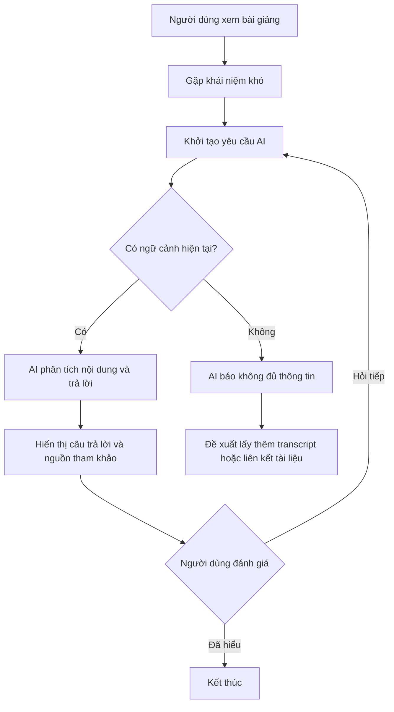

# User Workflows

## 1. Concept Clarification Workflow

### 1.1 Mục tiêu
Sinh viên đang học trên LMS/video/slide và cần giải thích một khái niệm ngay lập tức mà không chuyển tab.

### 1.2 Các bước chính
1. Sinh viên xem nội dung bài giảng (slide, video, transcript).
2. Sinh viên gặp khái niệm khó và chọn " hỏi AI" hoặc dùng nút gợi ý.
3. Hệ thống thu thập ngữ cảnh hiện tại:
   - OCR slide
   - Metadata video
   - Transcript đoạn đang xem
4. AI trả lời dựa trên nội dung hiện tại và đánh dấu nguồn tham khảo.
5. Sinh viên nhận câu trả lời, kiểm tra phần "Nguồn tham khảo" và tiếp tục học.
6. Sinh viên chọn:
   - "Đã hiểu" → kết thúc workflow
   - "Hỏi tiếp" → nối tiếp câu hỏi hoặc mở rộng kiến thức

### 1.3 Trường hợp thành công
- AI giải thích chính xác.
- Sinh viên ít gián đoạn hơn so với tìm kiếm bên ngoài.
- UX giữ mạch học liền mạch.

### 1.4 Trường hợp thất bại
- Không đủ ngữ cảnh vì video chưa có transcript.
- AI không xác định được nội dung hiện tại và trả về câu trả lời chung chung.
- Người dùng mất niềm tin nếu không có nguồn tham khảo rõ ràng.

### 1.5 Sơ đồ luồng
