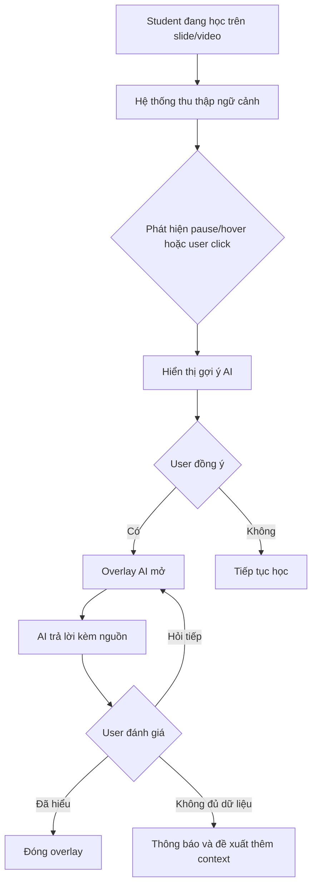

# User Experience

## 1. Trải nghiệm chính
Mục tiêu của UX là giữ sinh viên trong luồng học tập và giảm friction khi cần trợ giúp ngay lập tức.

### 1.1 Nguyên tắc thiết kế
- Giữ overlay nhẹ nhàng, không che chắn nội dung chính.
- Cung cấp phản hồi tức thì khi người dùng chọn hỏi hoặc hover/pause.
- Luôn hiển thị nguồn tham khảo rõ ràng để tăng độ tin cậy.
- Tránh hallucination bằng cách ưu tiên "Không tìm thấy thông tin" khi thiếu ngữ cảnh.

### 1.2 Các điểm chạm quan trọng
- Nút "Giải thích thêm" ngay trong slide/video.
- Hộp chat overlay nhỏ gọn, có thể đóng/mở nhanh.
- Badge nguồn tham khảo dẫn đến clip/slide tương ứng.
- Nút phản hồi "Đã hiểu" và "Hỏi tiếp".

## 2. Luồng trải nghiệm người dùng

### 2.1 Giai đoạn xem bài giảng
- Sinh viên duyệt slide hoặc xem video.
- Hệ thống theo dõi ngữ cảnh ngầm (slide hiện tại, thời điểm video, transcript).

### 2.2 Giai đoạn tương tác AI
- Khi người dùng hover hoặc pause, AI có thể gợi ý: "Bạn có muốn giải thích khái niệm này không?"
- Nếu người dùng chấp nhận, overlay bật lên.
- AI trả lời dựa trên nội dung hiện tại và cung cấp nguồn tham khảo.

### 2.3 Giai đoạn sau phản hồi
- Sinh viên đánh dấu "Đã hiểu" nếu câu trả lời đủ rõ.
- Nếu câu trả lời chưa đầy đủ, sinh viên tiếp tục đặt câu hỏi follow-up.
- Nếu AI không tìm đủ ngữ cảnh, đề xuất truy cập transcript/khoá học đầy đủ.

## 3. Chỉ số UX quan trọng
- Tỷ lệ nhấn "Đã hiểu" sau mỗi câu trả lời.
- Tỷ lệ giữ lại trên giao diện bài giảng sau khi truy vấn AI.
- Số câu hỏi follow-up cho cùng một khái niệm.

## 4. Hành vi đáng chú ý
- Tránh hiển thị AI quá sớm nếu không có dữ liệu ngữ cảnh.
- Dùng prompt gợi ý với mức độ chủ động nhẹ nhàng: "Bạn có muốn hiểu thêm không?"
- Tập trung vào chất lượng câu trả lời hơn số lượng tương tác.

## 5. Sơ đồ UX tổng quan
